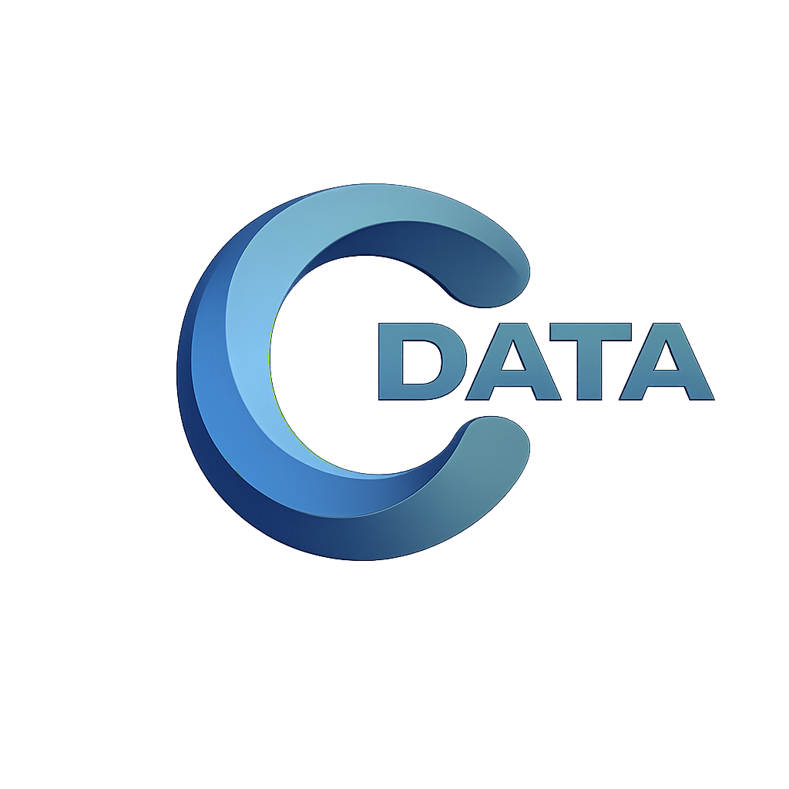
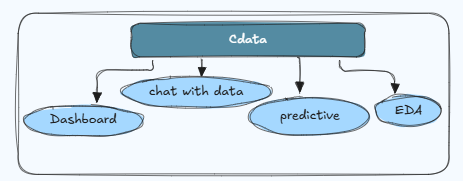
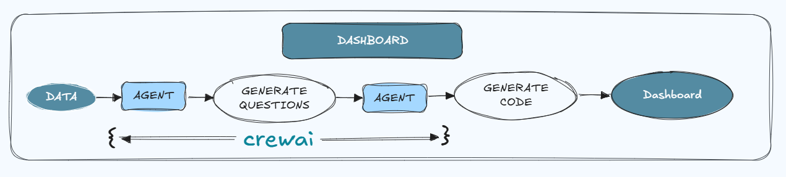

# Cdata: AI-Powered Data Analyzer 🚀📊

**Cdata** is an intelligent data analysis assistant that empowers users to understand, manipulate, and visualize their structured datasets interactively. Through natural language and an intuitive chatbot interface, Cdata allows you to:
- Analyze your data
- Generate dashboards automatically
- Perform preprocessing tasks
- Build predictive models
- Chat with your data

> 🎯 Whether you're a data scientist or a beginner, **Cdata** helps you unlock insights from your data with minimal effort.

---

## 🔧 Core Features

### 📌 1. Data Entry & Auto-Dashboard Generation

- Users upload structured data (`csv`, `xlsx`, `json`, `parquet`) or images (`jpg`, `png`, `jpeg`).
- Image uploads are processed using **pytesseract** to extract tabular content.
- Leveraging **CrewAI** agents:
  - **Agent 1**: Uses metadata to generate exploratory questions with **DeepSeek LLM**.
  - **Agent 2**: Uses the questions and metadata to generate visualization code with **DeepSeek LLM**.
- Code is executed using **Plotly**, and the resulting dashboard is rendered automatically.

---

### 💬 2. Chat With Your Data - Powered by **Soltan**

Talk to your data like a human! The **Soltan** chatbot (powered by **Gemini-1.5-Flash**) supports:
- ✅ Asking analytical questions (e.g., "What are the top-selling products?")
- ✅ Executing preprocessing tasks (e.g., dropping columns, merging files)
- ✅ Friendly talk (e.g., "Hi", "Who am I?")

**Soltan** uses a **Decision Maker LLM** to route queries:

| Query Type        | Action |
|------------------|--------|
| **Analysis**      | Generates Pandas code, cleans & executes it, returns table/visualization/insight |
| **Preprocessing** | Generates Python code to modify data (drop, merge, etc.) |
| **Non-serious**   | Returns a friendly response (e.g., “Thanks!”) |

After preprocessing, users can regenerate dashboards or EDA reports.

---

### 📈 3. Exploratory Data Analysis (EDA)

Generate a comprehensive EDA report using **`pandas-profiling`** / `ydata-profiling`, including:
- Data types and distributions
- Missing values
- Correlations
- Summary statistics

---

### 🤖 4. Predictive Modeling

Build machine learning models without writing a line of code:
- 📊 Supports **Classification**, **Regression**, and **Clustering**
- Select target column and problem type
- Choose model (e.g., Random Forest, KNN, etc.)
- Split data into train/test
- Train and **download your model**

---

## ✅ Supported Formats

- **Tabular files**: `CSV`, `XLSX`, `XLS`, `JSON`, `Parquet`
- **Image files**: `JPG`, `JPEG`, `PNG` (converted to tables using OCR)

---

## 💡 Technologies Used

| Component         | Technology        |
|------------------|-------------------|
| Chatbot & LLMs    | Gemini 1.5, DeepSeek |
| Dashboard Agent   | CrewAI            |
| Visualization     | Plotly            |
| EDA               | pandas-profiling  |
| ML Modeling       | Scikit-learn      |
| OCR               | pytesseract       |

---

## 📦 Project Architecture Overview

### High-Level Flow

### Dashboard Pipeline (via CrewAI)
1. User uploads data
2. Agent 1 → Describes data + generates questions
3. Agent 2 → Uses questions to generate code
4. Code → Executed with Plotly → Dashboard created

### Chatbot Pipeline
1. User asks a question
2. LLM decision maker chooses intent:
   - Analysis → Pandas code → Visualization + insight
   - Preprocessing → Modify data
   - Friendly talk → Chat
3. Output is always friendly and multilingual

---

## 🌍 Language Support

- English ✅  
- Arabic :coming soon

